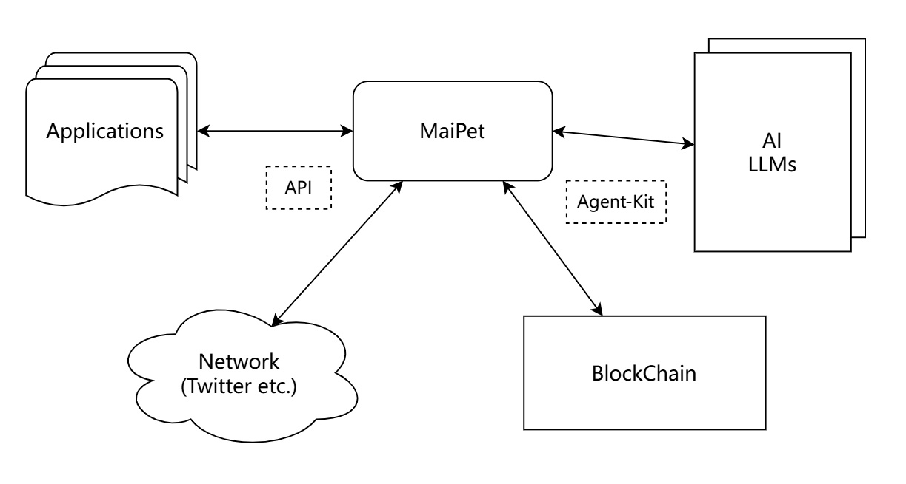

# MaiPet of MAI Agent

<div align="center">
  
</div>

## 🚩 Overview
### What's MaiPet & MAI Agent
MaiPet is the MAI Agent Desktop Pet. She is an AI-driven desktop assistant to help Web3 investors seamlessly analyze market data and manage emotional interactions with real-time insights.
The MaiPet Avatar running on the PC desktop first has the capabilities of an Agent tool, which can sense user actions/actions/content, and even emotions/sentiment in real time. Then it can be used as a desktop tool to help users perceive and operate multiple applications. The "sense/perception" and "operation" here are not just the capabilities of the user himself or his real assistant/subordinates. Based on the blessing of Agents and LLM, MaiPet can obtain more and richer auxiliary information in the network based on real-time "perception"., and analyze and predict by AI, and perform post-decision operations.

The MAI Agent is an innovative personal AI tool, crafted to empower users to efficiently and intelligently engage the Web3 ecosystem, enabling everyone to easily create their own IP Agents to perform functions such as AlphaScout and account management. More than just a smart assistant, the MAI Agent can emulate popular influencers, automatically curating and delivering the latest trending content, project updates, and market insights based on user interests and behaviors.

The name "MAI Agent" serves a dual purpose: it stands for "My AI Agent". MAI Agent contains multiple Agent Tools, MaiPet is one of them.

### Features
- Real-time AI support for Web3 investors to analyze markets.
- Access the most comprehensive data efficiently.
- Offering emotional support and development for users through an AI-driven emotional desktop assistant.
- K-line capture in real-time.
- K-line related data/event scrap in real-time.
- Use a variety of LLM for analysis, prediction, recording, etc. of K-line pictures/data.
- Engage early adopters through memecoin & NFT culture.
- Agent growth system and gamified experience
- Record the key data/event/person/token in real time during the work process.
- Perceive the data that users are paying attention to, and also remind users of the data that they are not paying attention to.
- The On-Chain agent data protection based on privacy computing and Web3 tech.

### Architecture

<div align="center">
  
</div>

<div align="center">
  
</div>

### Usage & Images

- **Desktop Pet Avatar:** 
<div align="center">
  
</div>

- **K-line Analysis & Prediction:** 
<div align="center">
  
</div>

- **Chat Window:** 
<div align="center">
  
</div>


### Readmap
- **Destop Alpha Assist for the Web3 Investor** 
- **Token Operator for the Web3 Investor** 
- **Recorder for the work flow** 
- **Social Media Operator for Web2 & Web3** 
- **Prediction Agent for the Web3 Investor** 
- **Agent Growth System and Gamified Experience** 
- **Autonomous Agent On-Chain** 

## 🤖 Demo
- [Demo1 (Feature Demo)](https://youtu.be/NkZSDCQzSbY)
- [Demo2 (Introduction)](https://youtu.be/NkZSDCQzSbY)

## 🚀 Quick Start

The frontend code locates at the client/ folder, and the backend code locates at the agent/ folder.

### Start Agent (Backend)

Copy .env.example to .env and fill in the appropriate values
```bash
cd agent/
copy .env.example .env
```

Build & Start the agent
```bash
pnpm install
pnpm build
pnpm start
```

### Desktop Installation (Frontend)

Copy .env.example to .env and fill in the appropriate values
```bash
cd client/
copy .env.example .env
```

Build & Install the Desktop App
```bash
npm install
npm start
```
